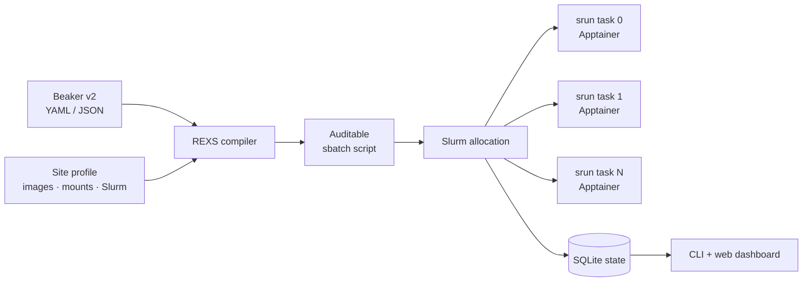

<div align="center">
  
  <h1>REXS</h1>
  <p><strong>Reproducible Experiments, eXecuted on Slurm.</strong></p>
  <p>Run the Beaker experiment configurations you already have on Slurm and Apptainer.</p>

  [](https://github.com/goncalorafaria/rexs/actions/workflows/ci.yml)
  [](https://goncalorafaria.github.io/rexs/)
  [](https://www.python.org/)
  [](LICENSE)
</div>

REXS is a small compatibility layer between Beaker v2 experiment files and a
Slurm cluster. It compiles each experiment into an auditable `sbatch` script,
runs every task replica as an exclusive `srun` step inside Apptainer, and uses
Slurm itself as the execution engine. A lightweight SQLite controller records
the submitted configuration, job state, task replicas, logs, and lifecycle
events.

It focuses deliberately on the Beaker features exercised by `datadev` and
LiteRegistry. Unsupported fields produce warnings; `--strict` promotes any
lossy translation to an error before submission.

## How it works



One Beaker experiment becomes one Slurm allocation. Task replicas are assigned
to nodes deterministically, receive Beaker-compatible replica environment
variables, share the host network, and write individual logs and result trees.
If one replica fails, REXS terminates its siblings and exits the allocation
with a failure.

## Install

```bash
git clone https://github.com/goncalorafaria/rexs.git
cd rexs
python -m venv .venv
. .venv/bin/activate
pip install -e .
```

The submission host needs `sbatch`, `squeue`, `sacct`, and `scancel`. Compute
nodes need `srun`, `scontrol`, and `apptainer`.

## Quick start

Copy the sample profile and adapt it to your Slurm site:

```bash
cp examples/profile.yaml profile.yaml
$EDITOR profile.yaml
```

Validate and render without touching Slurm:

```bash
rexs validate experiment.yaml --profile profile.yaml
rexs render experiment.yaml \
  --profile profile.yaml \
  --output experiment.sbatch
bash -n experiment.sbatch
```

Submit and inspect the run:

```bash
rexs submit experiment.yaml --profile profile.yaml --name my-run --strict
rexs experiments                 # queued and running only
rexs experiments --all           # include finished experiments
rexs status 123456
rexs logs 123456 --task=trainer --replica=0
rexs cancel 123456
```

Start the dashboard in the background:

```bash
rexs server --host=127.0.0.1 --port=8765 --daemon
# Open http://127.0.0.1:8765
rexs server_stop
```

The dashboard and all API routes require HTTP Basic authentication by default.
Use username `rexs`. On first start, REXS generates a unique password and saves it
with owner-only permissions in `~/.local/state/rexs/server.password` (beside a
custom state database when `--db` is used). Read it with:

```bash
cat ~/.local/state/rexs/server.password
```

The saved password persists across restarts. Set `REXS_SERVER_PASSWORD` in the
server's environment to override it; empty passwords are rejected. The password
is never included in server URLs, process arguments, or logs. After changing a
password, restart the server and sign in again. Authenticated API POST requests
must also send `X-REXS-Request: 1`; the dashboard adds this automatically.
Keep the loopback binding and access it through SSH port forwarding. Basic
authentication should use HTTPS if exposing the server beyond that tunnel.

The dashboard shows searchable experiment history, status filters, submitted
YAML, state transitions, task-level logs, and guarded cancellation.

## Site profile

Experiment intent remains in the Beaker file. Cluster policy belongs in a
separate REXS profile:

```yaml
account: research
partition: gpu
qos: normal
time_limit: "24:00:00"
cpus_per_task: 8
memory: 64G

apptainer_binary: apptainer
image_cache: /shared/rexs/images
image_dir: /shared/apptainer/images
dataset_root: /shared/datasets
run_root: /shared/rexs/runs
secret_file: ~/.config/rexs/secrets.env

setup_commands:
  - module load apptainer

images:
  org/trainer: /shared/apptainer/images/trainer.sif
  org/service: docker://ghcr.io/org/service:latest

datasets:
  weka:shared-data: /shared/data
```

Docker references are converted to `docker://` URIs automatically. Beaker
image names should be mapped to an OCI URI or existing SIF. Unmapped resources
fall back to predictable paths and generate warnings.

Secrets are loaded inside the allocation from `secret_file`; their values are
never written to the generated script or SQLite database.

## Supported Beaker subset

- Beaker v2 YAML and JSON
- `image.beaker` and `image.docker`
- command plus arguments
- plain and secret-backed environment variables
- task replicas and leader selection
- Beaker replica/job/hostname compatibility variables
- Weka, host-path, and mapped Beaker dataset mounts
- persistent per-replica result directories
- GPU, CPU, memory, and shared-memory advisories
- host-networked multi-service deployments
- `${VARIABLE}` configuration substitution

Workspace, budget, cluster constraints, priority, retry policy, scheduler
groups, and preemption metadata are not translated. Slurm policy comes only
from the site profile. See the [compatibility reference](docs/compatibility.md)
for exact behavior.

## Dry-run a repository

REXS can audit a directory full of experiment configurations without a Slurm
installation. It compiles every Beaker v2 YAML/JSON file and checks the output
with `bash -n`:

```bash
rexs dry_run ~/datadev/beaker_experiments
rexs dry_run ~/datadev/beaker_experiments --strict --details
rexs dry_run ~/other/experiments --output_dir=/tmp/rexs-scripts
```

No Slurm command is invoked in dry-run mode.

## State and output

Global state defaults to `~/.local/state/rexs/state.sqlite3` and can be changed
with `--db` or `REXS_STATE_DB`. SQLite uses WAL mode so the CLI and background
server can safely share it.

Runtime files are organized as:

```text
<run-root>/<slurm-job-id>/
├── logs/<task>.<replica>.log
└── results/<task>/<replica>/
```

Slurm remains authoritative. The controller reconciles active records through
`squeue` and completed records through `sacct`.

## Optional W&B capture

Install `pip install -e '.[wandb]'` to let the REXS server capture local W&B
logs automatically. Every 30 seconds it scans registered jobs' output directories
for `.wandb` files, including offline runs. No W&B login or upload is required.
Jobs without W&B continue normally; this does not change their launch commands.

Open a run and select **GPU metrics**, after **History**. Each GPU card plots utilization and allocated memory over time, with hover
values and the latest sample. Long histories retain extrema when reduced for display.
Samples remain available after the job finishes. Missing values display a dash;
stale samples are marked. GPU indices are local to each logger, so separate
sources may report the same physical devices.

Scalar history, summary and system metrics, plus W&B console output records,
are saved incrementally in the existing SQLite database (`wandb_sources`,
`wandb_records`, and `wandb_gpu_latest`). Incomplete trailing records are retried
on the next scan. Original files are read only. This is not a W&B artifact or
media archive; capture requires the log files to remain accessible to the server.
Set `REXS_CAPTURE_WANDB=0` before starting the server to disable collection
without deleting saved samples. Source errors do not interrupt jobs.

## Documentation

The full documentation lives in [`docs/`](docs/index.md) and is published with
GitHub Pages at **https://goncalorafaria.github.io/rexs/**.

To preview it locally:

```bash
pip install -e '.[docs]'
mkdocs serve
```

## Development

```bash
pip install -e '.[dev,docs]'
pytest -q
ruff check src tests
mkdocs build --strict
```

REXS is a clean-slate implementation inspired by
[`slurmcompose`](https://github.com/goncalorafaria/slurmcompose), scoped around
reproducible Beaker-to-Slurm execution rather than a fixed service composition.

## License

[MIT](LICENSE)

### GPU isolation with shared CPUs

With `shared_cpus_per_node`, CPU-only service steps use `--overlap --gres=none`. GPU steps use `--exclusive --exact --gpus-per-task=N --gpus-per-node=N` and their own CPU count, allowing Slurm to allocate disjoint GPUs to concurrent model replicas. GPU steps must fit together within the shared CPU budget. The container wrapper must preserve Slurm's `CUDA_VISIBLE_DEVICES` through `APPTAINERENV_CUDA_VISIBLE_DEVICES` when using `--cleanenv`.
