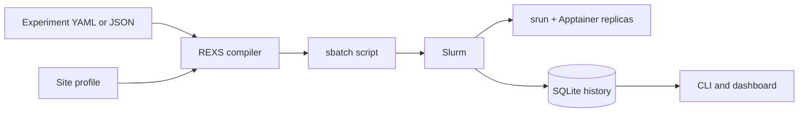

# REXS

**Reproducible Experiments, eXecuted on Slurm.**

REXS translates the Beaker v2 experiment files used by datadev and
LiteRegistry into transparent Slurm batch jobs. It combines a compiler,
Apptainer runtime, SQLite-backed controller, Fire CLI, and a small web
dashboard without trying to replace Slurm.

## Design goals

- **Keep experiment intent portable.** Scheduling policy, storage locations,
  and image resolution live in a site profile rather than in the experiment.
- **Make execution inspectable.** `rexs render` emits an ordinary shell script
  with explicit `#SBATCH`, `srun`, bind, environment, and cleanup commands.
- **Let Slurm stay authoritative.** REXS submits, observes, and records jobs;
  it does not implement a second scheduler.
- **Be honest about compatibility.** Unsupported Beaker fields warn by
  default and fail early with `--strict`.
- **Work offline.** Validation, rendering, and corpus-wide dry runs need no
  Slurm installation.

## Execution at a glance

1. REXS loads a Beaker v2 YAML or JSON document and applies exact
   `${VARIABLE}` substitutions.
2. A site profile resolves images, datasets, secrets, Slurm defaults, and
   output paths.
3. The compiler validates the supported subset and emits warnings for lossy
   fields.
4. One Slurm allocation is sized for all task replicas.
5. Every replica starts as an exclusive `srun` process inside Apptainer.
6. A supervisor implements fail-fast sibling cleanup and preserves the job's
   exit status.
7. Submission metadata and later Slurm state transitions are retained in
   SQLite for the CLI and dashboard.

Start with [Getting started](getting-started.md), then adapt the
[site configuration](configuration.md) to your cluster.

!!! note
    The first release is intentionally scoped to the features found in the
    datadev and LiteRegistry experiment corpus. It is not a complete Beaker
    server implementation.

